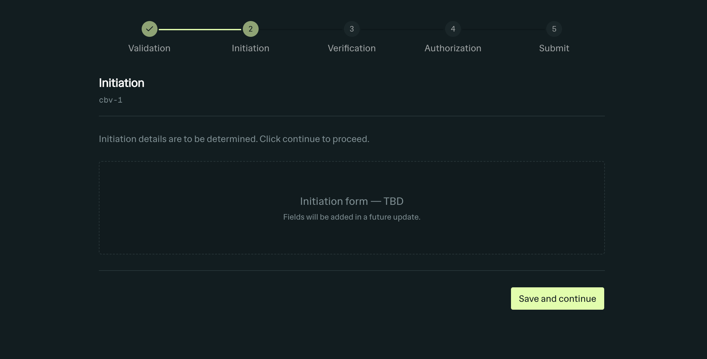

## Screenshot



---

## Zoto Workflow — Architecture & Pattern Reference

This document describes the multi-stage workflow engine that powers the CBV (Client Benchmark Verification) process. The same pattern can be replicated for any new workflow (e.g. KYC, Trade Review, etc.) by following the layers described below.

---

### File Structure

```
src/
├── app/
│   ├── __root.tsx                                 # Root layout, providers, error boundary
│   ├── index.tsx                                  # List page — table of all CBV records
│   └── cbv/$cbvId/index.tsx                       # Detail page — stepper + form for one CBV
│
├── config/
│   └── workflowConfig.ts                          # Central config: stages, status mapping, form map
│
├── db/
│   ├── index.ts                                   # Drizzle client (libsql / SQLite)
│   ├── schema.ts                                  # Tables, enums, column definitions
│   └── functions.ts                               # Server functions (CRUD + stage transitions)
│
├── forms/
│   ├── -components/
│   │   ├── AccountPicker.tsx                      # Combobox for adding client accounts
│   │   ├── ClientSsiTable.tsx                     # SSI record table (removable / editable)
│   │   └── SsiDetailSheet.tsx                     # Side-sheet for editing SSI record details
│   ├── ValidationForm.tsx                         # Stage 1 form
│   ├── InitiationForm.tsx                         # Stage 2 form
│   ├── VerificationForm.tsx                        # Stage 3 form
│   ├── AuthorizationForm.tsx                       # Stage 4 form
│   └── SubmitSummary.tsx                          # Stage 5 (terminal) — submit confirmation
│
├── hooks/
│   ├── useCbvWorkflow.ts                          # Core workflow hook (query + mutation + form key)
│   └── use-ssi-sheet-store.ts                     # Zustand store for SSI detail sheet state
│
├── registry/
│   └── cbvFormRegistry.ts                          # String key → Form component map
│
├── types/
│   └── cbv.ts                                     # CbvRecord, CbvStage, CbvStatus, CbvStageFormProps
│
├── components/
│   ├── workflow/
│   │   ├── CbvStepper.tsx                         # Visual stepper (stage indicator)
│   │   ├── CbvFormRenderer.tsx                    # Dynamically resolves form by key
│   │   ├── CbvFormActions.tsx                     # Action bar (Back / Save / Next / Cancel / Delete)
│   │   └── ConfirmDeleteDialog.tsx                # "Type CBV to confirm" delete dialog
│   ├── form.tsx                                   # Form field wrappers (FormInput, FormSelect, etc.)
│   ├── forms/                                     # Form layout wrappers (form-card, form-dialog, form-sheet)
│   ├── ui/                                        # Shadcn / base-ui primitives
│   └── providers.tsx                              # App-level providers (QueryClient, Theme, etc.)
│
├── lib/
│   ├── cbv-id.ts                                  # Sequential ID generator (cbv-1, cbv-2, …)
│   └── utils.ts                                   # cn() classname utility
│
└── router.tsx                                     # TanStack Router setup + mutation cache config
```

---

### Data Model

Two Drizzle/SQLite tables:

**`cbv`** — the main workflow record:

| Column | Type | Notes |
|---|---|---|
| `id` | `text` PK | e.g. `"cbv-1"` |
| `region` | `text` enum | APAC, EMEA, AMER, LATAM, MEA |
| `product_type` | `text` enum | FX, Rates, Equities, Credit, Commodities |
| `bu_mailbox` | `text` enum | FI_OPS, FX_OPS, EQ_OPS, RISK_OPS, TRADE_SUPPORT |
| `priority` | `text` enum | LOW, MEDIUM, HIGH, CRITICAL |
| `request_mode` | `text` enum | EMAIL, PHONE |
| `reviewer` | `text` nullable | Filled in Initiation |
| `reviewer_comments` | `text` nullable | Filled in Initiation / Verification |
| `authorizer` | `text` nullable | Filled in Authorization |
| `authorizer_comments` | `text` nullable | Filled in Authorization |
| `authorizer_signoff` | `integer` boolean, default `false` | Filled in Authorization |
| `current_stage` | `text` enum, default `"Validation"` | Current workflow stage |
| `status` | `text` enum, default `"pending-validation"` | Current workflow status |
| `cbv_requested_by` | `text` NOT NULL | Requester name |
| `cbv_date_time` | `text` default `CURRENT_TIMESTAMP` | Creation timestamp |

**`client_ssi`** — child records linked by `cbv_id` (cascade delete):

| Column | Type | Notes |
|---|---|---|
| `id` | `integer` PK (auto) | |
| `cbv_id` | `text` FK → `cbv.id` | Cascade delete |
| `beneficiary_name` | `text` NOT NULL | |
| `beneficiary_bic` | `text` nullable | |
| `account_number` | `text` NOT NULL | |
| `principal_party_name` | `text` nullable | |
| `company_code` | `text` nullable | |
| `address` | `text` nullable | |
| `currency` | `text` nullable | |
| `pdc` | `text` nullable | |
| `comments` | `text` nullable | |
| `country` | `text` nullable | |

---

### Stage & Status System

#### Stages

Defined in `config/workflowConfig.ts`:

```ts
const CBV_STAGES: StageConfig[] = [
  { step: 1, key: "Validation",    label: "Validation" },
  { step: 2, key: "Initiation",    label: "Initiation" },
  { step: 3, key: "Verification",  label: "Verification" },
  { step: 4, key: "Authorization", label: "Authorization" },
  { step: 5, key: "Submit",        label: "Submit", terminal: true }
]
```

#### Status mapping

Each stage maps to a `pending-*` status. When the final submit happens, the status becomes `resolved-completed`:

| Stage | Status |
|---|---|
| Validation | `pending-validation` |
| Initiation | `pending-initiation` |
| Verification | `pending-verification` |
| Authorization | `pending-authorization` |
| Submit | `pending-submit` |
| *(after final submit)* | `resolved-completed` |

The `stageToStatus` map and `getStatusForStage()` helper live in `config/workflowConfig.ts`. The server function (`updateCbvStage`) auto-computes status from stage unless an explicit `status` is passed — which only happens on the final submit action (`SubmitSummary` passes `status: "resolved-completed"`).

---

### How Stage Transitions Work

**Every transition — forward, backward, or save — uses the same function:** `onAdvance(nextStage, extra?)`. There is no separate "go back" or "save" API. The only difference is the `nextStage` argument:

| Action | Example call | Effect |
|---|---|---|
| **Next** (advance) | `onAdvance("Initiation", data)` | `currentStage → "Initiation"`, status → `"pending-initiation"`, fields overwritten |
| **Back** (go back) | `onAdvance("Validation", data)` | `currentStage → "Validation"`, status → `"pending-validation"`, fields preserved |
| **Save** (stay) | `onAdvance("Verification", data)` | `currentStage` stays `"Verification"`, fields saved |
| **Final Submit** | `onAdvance("Submit", { status: "resolved-completed" })` | `currentStage` stays `"Submit"`, status becomes `"resolved-completed"` |

The server function (`updateCbvStage`) receives `{ id, nextStage, status?, ...fields }`, computes `status ?? getStatusForStage(nextStage)`, and writes all fields in a single `UPDATE`.

---

### Server Functions

All defined in `db/functions.ts` using TanStack Start's `createServerFn`:

| Function | Method | Purpose |
|---|---|---|
| `getCbvList` | GET | List all CBVs ordered by date |
| `getCbvById` | GET | Get single CBV by ID |
| `createCbv` | POST | Create new CBV with defaults (`"Validation"` / `"pending-validation"`) |
| `deleteCbv` | POST | Delete CBV by ID (cascades to `client_ssi`) |
| `updateCbvStage` | POST | Core mutation — updates stage, status, and any provided fields |
| `getClientSsiList` | GET | List SSI records for a CBV |
| `addClientSsi` | POST | Add an SSI record |
| `updateClientSsi` | POST | Update SSI record fields |
| `deleteClientSsi` | POST | Delete an SSI record |

---

### useCbvWorkflow Hook

`src/hooks/useCbvWorkflow.ts` is the single hook consumed by the detail page:

```ts
const { cbv, isLoading, isAdvancing, currentFormKey, onAdvance } = useCbvWorkflow(cbvId)
```

| Return value | Description |
|---|---|
| `cbv` | The current `CbvRecord` (reactive via TanStack Query) |
| `isLoading` | True while fetching |
| `isAdvancing` | True while a stage mutation is in flight |
| `currentFormKey` | Derived: `stageFormMap[cbv.currentStage]` — e.g. `"ValidationForm"` |
| `onAdvance(nextStage, extra?)` | Call this to transition stages. `extra` can include any updatable field plus an optional `status` override |

The hook wraps `useQuery` + `useMutation`. On success it updates the local cache and shows a toast.

---

### Form Registry Pattern

`src/registry/cbvFormRegistry.ts` maps string keys to React components:

```ts
export const cbvFormRegistry: Record<string, ComponentType<CbvStageFormProps>> = {
  ValidationForm,
  InitiationForm,
  VerificationForm,
  AuthorizationForm,
  SubmitSummary
}
```

`config/workflowConfig.ts` maps stages to form keys:

```ts
export const stageFormMap: Record<CbvStage, string> = {
  Validation:    "ValidationForm",
  Initiation:    "InitiationForm",
  Verification:  "VerificationForm",
  Authorization: "AuthorizationForm",
  Submit:        "SubmitSummary"
}
```

`CbvFormRenderer` resolves the form at runtime: `cbvFormRegistry[currentFormKey]`.

**To add a new stage** you would:
1. Add the stage key to `cbvStageEnum` in `schema.ts`
2. Add the stage config to `CBV_STAGES` in `workflowConfig.ts`
3. Add a status mapping in `stageToStatus`
4. Add the form key mapping in `stageFormMap`
5. Create the form component in `src/forms/`
6. Register it in `cbvFormRegistry.ts`
7. Run `pnpm db:push` to update the database

---

### Form Component Contract

Every form receives `CbvStageFormProps`:

```ts
interface CbvStageFormProps {
  cbv: CbvRecord
  onAdvance: (nextStage: CbvStage, payload?: Partial<Omit<CbvRecord, "id" | "currentStage" | "status">> & { status?: CbvStatus }) => Promise<void>
  onCancel: () => void
  onDelete: () => void
  isAdvancing: boolean
  isDeleting?: boolean
}
```

Each form:
1. Defines a **Zod schema** for its own fields
2. Uses **react-hook-form** with `zodResolver`
3. Pre-fills defaults from the `cbv` record
4. Renders `CbvFormActions` with callbacks for Back / Save / Next / Cancel / Delete
5. Passes `isResolved={cbv.status === "resolved-completed"}` to `CbvFormActions`

When `isResolved` is true, `CbvFormActions` hides Back, Save, Next, and Cancel — only the Delete button remains.

---

### CbvFormActions

`src/components/workflow/CbvFormActions.tsx` renders the action bar at the bottom of every form:

| Prop | Type | Description |
|---|---|---|
| `nextLabel` | `string?` | Label for the submit button (default `"Next"`) |
| `canBack` | `boolean?` | Whether Back is enabled (default `true`; `false` for Validation) |
| `isBusy` | `boolean?` | Whether a mutation is in flight |
| `isDeleting` | `boolean?` | Whether a delete is in flight |
| `isResolved` | `boolean?` | When `true`, only shows Delete |
| `onBack` | `() => void?` | Go back one stage |
| `onSave` | `() => void?` | Save (stay on current stage) |
| `onCancel` | `() => void` | Navigate back to list |
| `onDelete` | `() => void` | Open the delete confirmation dialog |

---

### Delete Confirmation

`ConfirmDeleteDialog` is a controlled Dialog (`src/components/workflow/ConfirmDeleteDialog.tsx`):
- Requires the user to type **"CBV"** into an input field
- The "Delete" button is disabled until the input matches exactly
- Used on both the list page (table trash icon) and the detail page (form Delete button)

---

### Stepper

`src/components/workflow/CbvStepper.tsx` renders a horizontal step indicator:
- Derives `currentStep` from `stageIndex(cbv.currentStage) + 1`
- When `cbv.status === "resolved-completed"`, it sets `activeStep` beyond the last step so all indicators show as completed
- Steps are non-interactive (navigation happens via form buttons only)

---

### Resolved / Completed State

When the Submit button on `SubmitSummary` is clicked:
1. `onAdvance("Submit", { status: "resolved-completed" })` is called
2. The server sets `currentStage = "Submit"` and `status = "resolved-completed"`
3. `CbvStepper` detects `resolved-completed` and marks all steps as completed
4. `CbvFormActions` detects `isResolved = true` and hides Back / Save / Next / Cancel — only Delete remains
5. The page header shows the uppercase status badge

---

### Child Records (Client SSI)

The CBV workflow manages child `client_ssi` records through:
- **AccountPicker** — Combobox for adding accounts during Validation
- **ClientSsiTable** — Display and manage rows (removable mode in Validation, editable in Initiation)
- **SsiDetailSheet** — Side-sheet form for editing individual SSI details, controlled by `useSsiSheetStore` (Zustand)

This pattern (parent record + child records through sheets) can be replicated for any workflow with line items.

---

### Replicating This Pattern for a New Workflow

To create a new workflow (e.g. "KYC Review"), follow these steps:

1. **Schema** — Define the table in `src/db/schema.ts`:
   - Add a `kycStageEnum` and `kycStatusEnum`
   - Create the `kyc` table with `current_stage` and `status` columns
   - Add any child tables with foreign keys

2. **Server functions** — Add CRUD functions in `src/db/functions.ts`:
   - `getKycList`, `getKycById`, `createKyc`, `deleteKyc`
   - `updateKycStage` — the core mutation (same pattern as `updateCbvStage`)

3. **Config** — Create `src/config/kycWorkflowConfig.ts`:
   - Define `KYC_STAGES`, `stageToStatus`, `getStatusForStage()`, `stageFormMap`, `stageIndex()`

4. **Types** — Add to `src/types/kyc.ts`:
   - `KycRecord = InferSelectModel<typeof kyc>`
   - `KycStage`, `KycStatus`
   - `KycStageFormProps` (same shape as `CbvStageFormProps`)

5. **Registry** — Create `src/registry/kycFormRegistry.ts`

6. **Forms** — Create each stage form in `src/forms/kyc/`:
   - Each form uses Zod + react-hook-form, receives `KycStageFormProps`, calls `onAdvance`
   - Each form renders `KycFormActions` (or reuse/rename `CbvFormActions`)

7. **Hook** — Create `src/hooks/useKycWorkflow.ts`

8. **Components** — Create stepper, form renderer, delete dialog under `src/components/workflow/kyc/`:
   - Or make the existing components generic by accepting config as props

9. **Routes** — Add `src/app/kyc/$kycId/index.tsx` for the detail page and update `src/app/index.tsx` (or create a new list page)

10. **Push** — Run `pnpm db:push` to sync schema changes to the database